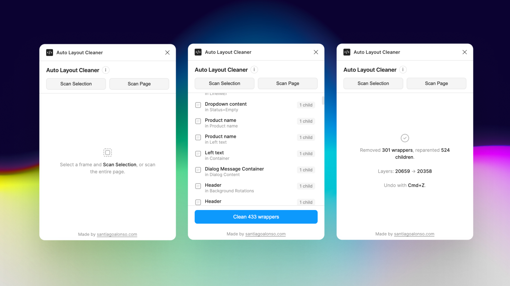

  

<h1 align="center">Auto Layout Cleaner</h1>

Find and remove redundant wrapper frames in your autolayout hierarchies. 
One click to flatten. One undo to revert.

Figma Plugin

<a href="https://www.figma.com/community/plugin/1608984541189092337/auto-layout-cleaner"><strong>Install from Figma Community</strong></a>

  

---

## What It Does

Scans selected frames (or the entire page) for **redundant wrapper frames** — autolayout frames that sit between a parent and its content but add nothing visually. It reparents the children up to the grandparent and deletes the empty wrapper. The UI stays identical.

## What Counts as Redundant

A frame is flagged for removal when **all** of these are true:

- Type is `FRAME` (never touches instances, components, or component sets)
- Parent is also not an instance/component/component set
- Both the frame and its parent have autolayout enabled
- No visible fills, strokes, effects, or corner radius
- No padding on any side
- No clipping that the parent doesn't already have
- Opacity is 1, blend mode is normal/pass-through
- Has at least 1 child
- **Single child:** always redundant
- **Multiple children:** only redundant if the parent has the same layout direction, gap, and wrap mode

## Install

1. Clone or download this repo
2. In Figma Desktop: **Plugins > Development > Import plugin from manifest...**
3. Select the `manifest.json` file from this folder

## How to Use

1. Select the frame(s) you want to clean up
2. Run the plugin: **Plugins > Development > Auto Layout Cleaner**
3. Click **Scan Selection** (or **Scan Page** for the whole page)
4. Review the list of redundant wrappers found
5. Click **Clean X wrappers** to flatten them all
6. If anything looks wrong: **Cmd+Z** to undo everything in one step

## Limitations

- **Instance internals** — read-only, can't reparent children inside instances
- **Component internals** — modifying would break all instances
- **Direction changers** — a horizontal frame inside a vertical parent is intentional structure, not redundancy
- **Gap changers** — frames with different `itemSpacing` than their parent create spacing groups on purpose
